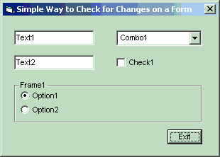



## ISChanged

### Description

Simple way to check for changes on a form.
 
### More Info
 

             |
---                |---
**Submitted On**   |2002-01-08 08:58:26
**By**             |[VincentK\.](https://github.com/Planet-Source-Code/PSCIndex/blob/master/ByAuthor/vincentk.md)
**Level**          |Intermediate
**User Rating**    |5.0 (35 globes from 7 users)
**Compatibility**  |VB 5\.0, VB 6\.0
**Category**       |[Complete Applications](https://github.com/Planet-Source-Code/PSCIndex/blob/master/ByCategory/complete-applications__1-27.md)
**World**          |[Visual Basic](https://github.com/Planet-Source-Code/PSCIndex/blob/master/ByWorld/visual-basic.md)
**Archive File**   |[ISChanged47188182002\.zip](https://github.com/Planet-Source-Code/vincentk-ischanged__1-30560/archive/master.zip)

